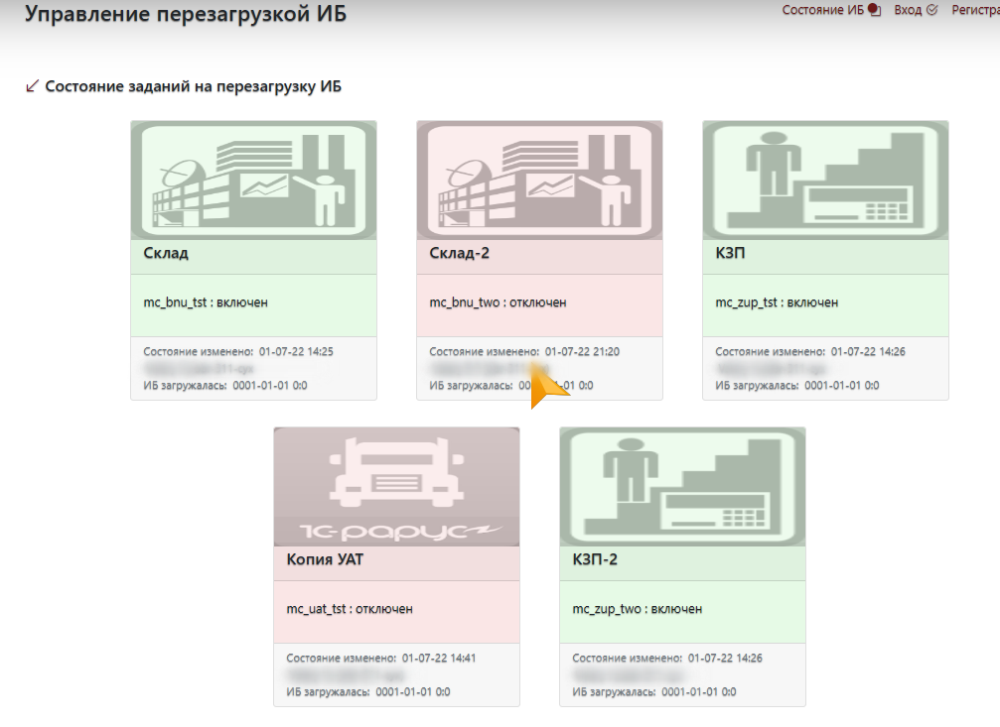

# Веб-страница для управления перезагрузкой тестовых ИБ

Предназначена для включения/отключения скриптов, загружающих бэкап рабочих ИБ в тестовые.



Данные аутентификации хранятся в базе SQLite `ibcntr/db.sqlite`
Для создания БД нужно выполнить команды:

``` python
from ibcntr import db, create_app, models  
>>> db.create_all(app=create_app())

скрипт работает в виртуальном окружении `venv`. Чтобы настроить окружение и установить в нее все необходимое, нужно выполнить команды:  

```sh
cd <repo>
$ python3 -m venv venv
$ source venv/bin/activate
(cntib) $ pip install -r requirements.txt
```

на продуктиве, живучестью сервиса управляет сервис ubuntu `supervisor`  

```
$ sudo apt-get -y install supervisor nginx
```

[конфигурационный файл](deployment/supervisor/cntrib.conf) `/etc/supervisor/conf.d/ibcntr.conf`:

```
[program:runner]
command=/opt/cntib/venv/bin/gunicorn -b localhost:8000 -w 4 runner:ibcntr
directory=/home/vsuh/Dropbox/projects/flask-ibcntr
user=vsuh
autostart=true
autorestart=true
stopasgroup=true
killasgroup=true
```

Настройки рабочего экземпляра проекта в файле `conf/.env`

```
SECRET_KEY = 'a92d74111111111111111111111dbc29'
LOG_TO_STDOUT = False
REDIS_URL = 'redis://redis-hostname-or-ip/1?decode_responses=True&health_check_interval=2'
PROD_APP_NAME = 'ibcntr'
```

Данные хранятся в БД `redis`

В API добавлена команда `/initialize_db_fast`, которая заполняет подключенную базу данных набором тестовых данных.


Для (пере)создания sqlite БД нужно выполнить команды:

``` python
>>> from ibcntr import db, create_app, models  
>>> db.create_all(app=create_app())
```


источник: https://www.digitalocean.com/community/tutorials/how-to-add-authentication-to-your-app-with-flask-login-ru
